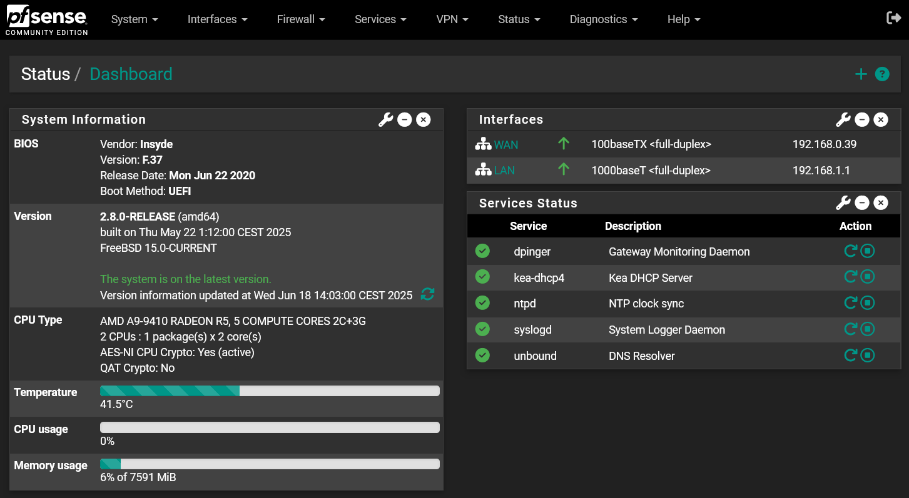

### *to be continued...*

# **Welcome, in my HomeLab Project!**

[](https://github.com/goAuD/MyHomeLab/discussions/1)
## *Details:*

<details>

<summary><strong>  Introduction – Who I am and what this project is about</strong></summary>

---

My name is Viktor Halupka, I was born in Budapest, and I have been living in Austria since 2014.  
Since my childhood (Commodore 64), I have been interested in the world of IT, but I worked in the gastronomy industry for a long time.  
At the age of forty, however, I decided to make a dream come true: to work professionally with IT, networks, and servers.

This homelab project is the first step on that path: I am building a real, working test environment on my own budget and in my free time, in order to gain hands-on experience in system and network administration.

This is not a perfectly sterile lab, but rather a fine worked, dynamically evolving learning platform, with its own mistakes, solutions, and documentation.

### My goal with this project is to:

- demonstrate my progress,

- build a stable, remotely accessible, container-based home service platform that also serves as a learning environment,  

- help other beginners who are starting a similar journey, and  

- convince my future employer that they are dealing with a motivated, eager-to-learn, and practical-minded person.

**It’s never too late to change direction – the only thing that matters is that you take the first step.**

</details>

---

<details>

<summary><strong>  Equipment Overview |2025|</strong></summary>

---

#### Workstations and Servers

#### MSI Thin 15 B12UC laptop:

- CPU: Intel Core i5 (12th generation)  

- RAM: 32 GB  

- VGA: Nvidia RTX 3050  

- Storage: 1 TB NVMe SSD  

- OS: Fedora Linux  

- Purpose: Learning system administration, network simulations, monitoring  

#### Windows 11 Pro PC (main server):

- CPU: Intel Core i7-8700K  

- RAM: 32 GB  

- VGA: Nvidia RTX 3060 Ti  

- Storage: 2× 1 TB NVMe SSD, 1 TB HDD  

- Roles: Plex + Tailscale media server, planned NGINX web server  

#### HP 15-ba106ng laptop (pfSense router):

- CPU: AMD A9-9410  

- RAM: 8 GB  

- Storage: 1 TB HDD  

- OS: pfSense (fresh install, in configuration)  

- Roles: Firewall, DHCP, NAT, VLAN, port forwarding, VPN (WireGuard planned)  

### Network

---

- Netgear GS308E managed switch (8 ports)  

- UNI USB–Ethernet adapter for HP laptop  

- ISP Routers:  

  - ZTE MC888A Ultra (5G, main internet)  

  - ZTE H338A (4G, backup)  

### Mobile Devices

---

- iPhone 11 (static public IP, uses Tailscale)  

- Samsung tablet (Android 14, media playback, remote access)  

### Backup and Security

---

- Using pfSense Firewall

- Weekly full system backup

- Planning incremental backups  

- Documents on OneDrive for mobile access  

- Plexamp + Tailscale used during commutes for music  

- Tailscale exit node automatically enabled on iPhone for public network security  

</details>

---

<details>

<summary><strong>  Planned Developments</strong></summary>

---

- Set up NGINX web server on Windows  

- Create basic static website for portfolio/monitoring  

- Finish pfSense full configuration  

- Update automation with Ansible

- Docker installation with Photoprism for photo cataloging and secure, remote access from mobile

- Planning Wake-on-LAN and remote server control automation 

</details>

---

# 🧙‍♂️ The Sysadmin's Verse 🧙‍♂

```
One Firewall to rule all them,
One DNS to find them,
One DHCP to bring them all,
And in the darkness bind them.

```

## *A pfSense tale where NAT and DHCP rules reign supreme - and only one sysadmin apprentice stands between order and chaos.*

> *"Tuned in the darkest corners of Mordor..."*

pfSense Dashboard Snapshot:



<sub><i>Status of my pfSense - minimal CPU load, low memory usage, and a KEA-powered DHCP. Yes, DNS Unbound still reigns supreme.</i></sub>

---

<details>

<summary><strong> Network Topology - 2025 Summer Edition</strong></summary>

### 1. ISP Router

- Acts as the upstream connection to the internet.

- Either in bridge mode or with DMZ pointing to pfSense.

- Connected via Ethernet to the pfSense WAN interface.

### 2. pfSense (running on an old laptop)

- Serves as the main router and firewall.

- Interfaces:

  - **WAN** → connected to ISP router.

  - **LAN** → connected to local network via a switch.

- Provides:

  - DHCP and DNS for the LAN.

  - NAT, port forwarding, and firewall rules.

  - Future plans: pfBlockerNG, Tailscale subnet routing.

### 3. LAN Switch

- Connected to the pfSense LAN port.

- Distributes LAN connectivity to wired devices and access points.

### 4. Devices connected to the switch

- **PC (Windows 11 Pro)**

  - Hosts Plex Media Server and PhotoPrism (via Docker/Portainer).

  - Also used for general administration and monitoring.

- **ZTE Router (WLAN Access Point Mode)**

  - Provides Wi-Fi only (DHCP disabled).

  - Connected via Ethernet to the switch.

### 5. Devices connected via Wi-Fi (through ZTE AP)

- Smartphones

- Tablets

- Smartwatch

- Nokia streaming box

- HP printer

- IoT gadgets

### 🔁 Traffic Flow Summary

[Internet] → [ISP Router] → [pfSense WAN] → [pfSense LAN] → [Switch] → [PC / AP] → [Wi-Fi tools]

</details>

---

## Synopsis
This isn’t just a HomeLab project. This is an epic.

An old HP laptop, once forgotten, rises again – not as a client, but as a firewall.  
The hero's journey spans two interfaces: one toward the ISP, one into the heart of the LAN.  
Along the way, they face mythical entities such as `dhcpd`, the `pfctl` daemon, and the fearsome `nbound`.

## ⚔️ The Quest

- [x] Install pfSense on a 2017-ish laptop that wheezes under load

- [x] Configure WAN/LAN interfaces (with some reboot rituals)

- [x] Grant LAN devices access to the internet – *finally*

- [x] Explore the dark arts of port forwarding

- [x] Integrate Tailscale, Plex, DNS

- [ ] Never reinstall again (lol, sure...)

# 🛠️ pfSense Disaster Recovery Guide

In a critical failure scenario (e.g. failed update, hardware corruption, misconfiguration), it is important to be able to **fully recover your pfSense system** quickly — ideally within minutes. Below is a set of recommended methods and a backup strategy designed for a home lab environment.

---

### 🧩 Components of a Full Backup Strategy

| Component       | Method                                  | Frequency        |
|----------------|------------------------------------------|------------------|
| System Image    | Clonezilla disk image                   | Weekly or Monthly |
| Configuration   | pfSense XML backup (via Web UI)         | After every change |
| Diagnostics     | PRTG monitoring system                  | Ongoing           |

---

### ✅ Method 1: Full Disk Image Backup with Clonezilla (Recommended)

**Why**: Clonezilla creates a full, bootable disk image, allowing you to restore pfSense with all packages (e.g. pfBlockerNG, DNSBL, GeoIP, Tailscale, etc.) and settings intact.

#### Requirements:

- Clonezilla Live USB: https://clonezilla.org/clonezilla-live.php

- External USB drive or second USB stick (as destination)

- Keyboard and screen attached to pfSense device (e.g. laptop)

#### Steps:

1. Gracefully shut down pfSense (`Diagnostics > Halt System`)

2. Boot from the Clonezilla Live USB stick

3. Select `device-image` mode → `savedisk`

4. Choose your external storage as the backup destination

5. Confirm and create full disk image

6. Store this safely (optionally versioned by date)

#### Restore:

- Boot Clonezilla again → `restoredisk` → select image → restore to the same disk

---

### ✅ Method 2: Manual Disk Image with `dd` (Advanced)

You can use the FreeBSD `dd` command to make a raw copy of the disk.

```sh
dd if=/dev/ada0 of=/mnt/usb/pfsense_backup.img bs=1M

```

# 🔧 pfSense CPU Optimalization (Low-Performance Hardware)

My pfSense system runs on an older AMD dual-core laptop (2017 or older), so minimizing unnecessary CPU usage is critical. These settings help reduce overhead and improve responsiveness without sacrificing essential functionality.

### ✅ System tunables (under **System > Advanced > System Tunables**)

The following values are either already optimized in pfSense 2.8.0 or can be explicitly checked and set:

| Tunable Name                     | Recommended Value | Description |
|----------------------------------|-------------------|-------------|
| `kern.pti`                       | `0` *(disabled)*  | Disables Kernel Page Table Isolation (PTI). Recommended for older CPUs for performance, unless high security required. |
| `net.inet.tcp.syncookies`        | `1`               | Enables SYN cookies to prevent SYN flood attacks with minimal CPU overhead. |
| `net.inet.tcp.drop_synfin`       | `1`               | Drop suspicious SYN+FIN packets (common in scans). |
| `net.inet.ip.redirect`           | `0`               | Disable sending IP redirects. |
| `net.inet.icmp.icmplim`          | `50` or lower     | Limits ICMP rate (e.g., ping flood). |
| `net.link.bridge.pfil_onlyip`    | `1`               | Filter only IP packets on bridges (saves CPU). |
| `net.link.bridge.pfil_member`    | `0`               | Avoid redundant filtering on bridge members. |
| `net.inet.tcp.rfc1323`           | `0`               | Disables TCP window scaling — optional, may help older devices. |
| `net.inet.tcp.tso`               | `0`               | Disable TCP segmentation offloading if using USB NICs or buggy drivers. |

---

### ❌ Disable unnecessary services (in **Services** or **Interfaces** sections)

You should disable features you don't actively use:

- **UPnP**: `Services > UPnP & NAT-PMP` → Uncheck “Enable UPnP & NAT-PMP”

- **Captive Portal**: `Services > Captive Portal` → Disable any active zone.

- **Traffic Shaper**: `Firewall > Traffic Shaper` → Remove or avoid setting up shapers.

- **IPv6 Router Advertisements**: `Interfaces > LAN > Router Advertisements` → Set to "Disabled"

- **IPv6** entirely (optional): `Interfaces > WAN/LAN > Static IPv6 Configuration` → Set IPv6 Configuration Type to "None"

---

### 💡 Additional Suggestions

- Disable unused **interfaces** and **bridges**.

- Use **lightweight packages** only (avoid pfBlockerNG or Snort on low CPU).

- Regularly monitor system load via **Status > System Logs > System Activity**.

- Avoid running unnecessary **DNSBL**, **GeoIP** or **deep packet inspection** functions.

---

These optimizations have significantly reduced random CPU spikes and unnecessary ARP traffic in my home lab. Stability and responsiveness improved especially under typical loads (streaming, LAN routing, Plex, Tailscale, etc.).

# 🔄 Keeping pfSense and FreeBSD Updated (The Safe Way)

### ❓ Should You Manually Update FreeBSD on pfSense?

**No — never update FreeBSD manually on a pfSense system.**  
Although pfSense is based on FreeBSD, it's a heavily customized and integrated system. Manual updates using tools like `freebsd-update` or `pkg upgrade` can break critical components of pfSense, such as:

- The web interface (GUI)

- Firewall rules and NAT

- Package manager compatibility (e.g. pfBlockerNG, Suricata, etc.)

---

### ✅ How to Properly Update pfSense (and FreeBSD)

Always use the **built-in pfSense update mechanism** to ensure compatibility and stability.

#### Steps to Update:

1. Log in to the pfSense Web UI (e.g. `https://192.168.1.1`)

2. Go to:  
   `System` → `Update` → `Update Settings`  

   - Make sure the **Branch** is set to: `pfSense CE Latest` (or `pfSense Plus` if applicable)

3. Then go to:  
   `System` → `Update` → `System Update`

4. If an update is available, click **"Confirm"** to proceed.

5. The system may reboot after the update.

> This process updates both the FreeBSD base and pfSense components in a coordinated, safe way.

---

### 📅 How Often Should You Update?

- **Every 2–3 months**: Check for new versions manually

- **Immediately** if a **security update** is announced

- **When** you need bug fixes or new features

---

### 🛑 Do *NOT* Run These Commands on pfSense:

```sh
freebsd-update fetch
freebsd-update install
pkg update
pkg upgrade

```

# 🧠 Network Issue Log 2025|06|23

## 🔹 1. "Ghost IP" – 192.168.0.23 (incomplete)

**Issue:**  
pfSense kept showing `192.168.0.23` in the ARP table with `(incomplete)` status – no MAC address, no obvious source. Looked like a device was trying to connect, but nothing existed on the network with that IP.

**What I tried:**  

- Checked with `arp -a`, `tcpdump -i re0 host 192.168.0.23` – no response  

- Despite that, ICMP traffic showed up in pfSense logs: something was pinging that IP from the LAN

**Solution:**  
Turned out it was **PRTG** still trying to ping a **nonexistent legacy device**. The sensor was still active even though the device was long gone.

✅ Deleted/disabled the sensor in PRTG → no more ghost IP in ARP.

---

## 🔹 2. Sticky IP–MAC Binding – 192.168.0.39 (permanent)

**Issue:**  
192.168.0.39 kept showing up in pfSense's ARP table on the WAN interface (`re0`) as `permanent`, even after I removed the static DHCP mapping.

**Initial suspicion:**  
Thought it was my **Netgear GS308E switch**, which had the MAC `40:b0:34:6b:98:32`. I even hard-reset the switch, but the binding still showed up.

**Root cause:**  
The **same IP–MAC binding was active on both routers**:  

- The old **ISP router** had it set as a static DHCP lease  

- The new **pfSense** setup inherited or clashed with it

**Fix:**  
Removed the static mapping from *both* routers. After that, pfSense was finally able to clear the ARP cache and release the IP properly.

---

## 🟨 Additional Notes

- That ghost IP (192.168.0.23) was purely from **PRTG’s leftover sensor**, not an actual device.

- The **Netgear GS308E** switch did not respond to the config utility properly – possibly due to network mismatch or software limitations.

- PRTG also showed the **HP printer as down**:  
  `"hp0418e8"` could not be resolved → hostname/DNS issue. May need to switch the printer to a static IP with proper DNS registration.

---

## ✅ Summary

- [x] Ghost IP (192.168.0.23) → caused by PRTG, resolved by disabling the sensor  

- [x] Sticky IP–MAC (192.168.0.39) → caused by duplicate DHCP static mappings on both routers, fixed by removing both  

- [x] Cleaned ARP and DHCP mappings in pfSense  

- [ ] Still need to verify DNS config for the printer

# 🧾 USB Power Stability Investigation (pfSense USB-LAN Adapter)

## 🎯 Goal
To diagnose and fix the unstable USB-LAN connection (AX88179) on a pfSense router running on an older laptop, which was randomly dropping the LAN interface.

---

## 🧩 Symptoms

- Frequent `ue0: link state changed to DOWN/UP` messages in system logs.

- `php-fpm /rc.linkup` events triggered continuously.

- `DEVD Ethernet detached/attached` events suggesting the interface was being hotplugged.

- Internet drops with no automatic recovery.

---

## 🔬 Investigation Steps

## 1. Check USB Device State with `usbconfig`

Command:

```sh
usbconfig

```
Example output:

```sh
ugen1.4: <AX88179 Gigabit Ethernet ASIX Electronics Corp.> at usbus1, cfg=0 md=HOST spd=HIGH (480Mbps) pwr=ON (100mA)

```

### Key observations:

- spd=HIGH → indicates USB 2.0 mode (480 Mbps).

- pwr=ON (100mA) → relatively low power draw.

- Device was getting power but still disconnecting under load.

## 2. Switched to Another USB Port

- The adapter was physically moved to another USB port (from the left to the right side).

- The previously used port may have been damaged (due to a drop).

## Result: connection became stable.

## 3. Added a Powered USB Hub
Introduced an external powered USB hub (VIA Labs VL813 chipset).

### Purpose:

- Delivers stable 5V power independently of the laptop’s USB rail.

- Offloads power delivery from the potentially degraded USB controller.

- Improves overall connection stability.

## 4. Disabled USB Suspend in FreeBSD
To prevent the OS from putting the USB interface into suspend mode:

### File:

```sh
/boot/loader.conf.local

```

### Added line:

```sh
hw.usb.no_suspend=1

```
> This disables automatic USB power management that could cause disconnections due to idle suspend behavior.

## ✅ Result:

- The USB Ethernet adapter has remained stable since the above fixes.

- No more ue0 link flapping in the logs.

- Connection stays alive even overnight.

- pfSense operates as expected without interface drops.

## 📌 Notes:

- BIOS settings had no USB power/suspend options available.

- NGINX-related syslog errors observed were unrelated (internal pfSense logging).

- USB 2.0 bandwidth is enough for 250 Mbps ISP line.

- Powered USB hub is an effective workaround for underpowered USB ports or hardware wear.

## 📚 Lessons Learned:

- Physical issues like worn or damaged USB ports can appear as software instability.

- FreeBSD’s power-saving defaults may interfere with continuous interface use.

- A simple USB hub with external power can significantly increase reliability in low-cost homelab setups.

---

# pfBlockerNG Setup and Optimization – Summary

## 🔧 Installation

- Installed `pfBlockerNG-devel` via the pfSense Package Manager.

- After the wizard completed, we manually adjusted the key modules:

  - `DNSBL` (domain-based blocking)

  - `IPv4` (IP-based blacklists)

  - `GeoIP` (country-based IP filtering)

## ⚙️ Core Settings

- **DNS Resolver (Unbound)** is enabled.

- In `System > General Setup`, we **did not define external DNS servers** (like 8.8.8.8).

- DNS field is left empty or set to `127.0.0.1`.

- ✅ `Allow DNS server list to be overridden by DHCP/PPP on WAN` is **disabled**.

## 🧱 DNSBL

- Activated the `StevenBlack_ADs` list (over 202,000 blocked domains).

- SafeSearch feature is currently disabled.

- Whitelist includes: `localhost.localdomain`.

## 🌍 GeoIP

- Successfully downloaded and processed MaxMind GeoLite2 database.

- Continent and country-specific IP data was generated.

- Created a GeoIP blocking list:

  - Named `Block_RU_CN`, using `Deny Inbound` action for **Russia (RU)** and **China (CN)**.

## 🚫 IP Blacklists (IPv4)

Active lists and number of blocked IPs:

| List name         | IP count | Notes                        |
|-------------------|----------|-------------------------------|
| CINS_army_v4      | 12,240   | Honeypot attacker IPs         |
| ET_Block_v4       | 1,470    | Emerging Threats blocklist    |
| ET_Comp_v4        | 438      | Supplementary ET list         |
| Spamhaus_Drop_v4  | 5        | Very reliable blacklist        |
| ISC_Block_v4      | 2        | Internet Storm Center         |
| Abuse_SSLBL_v4    | 1 (dummy)| ⚠️ Empty – to be removed       |
| Abuse_Feodo_C2_v4 | 1 (dummy)| ⚠️ Empty – to be removed       |
| Talos_BL_v4       | ❌ Error | ✔️ Removed due to 403 failure  |

> 📌 All IP lists use `Deny Inbound` mode.

## ➕ Recommended IP Lists Added

| List name         | Source URL                                                              | Notes                         |
|-------------------|-------------------------------------------------------------------------|-------------------------------|
| Blocklist_de_all  | `https://lists.blocklist.de/lists/all.txt`                              | Attacker IPs from honeypots   |
| DShield           | `https://feeds.dshield.org/block.txt`                                   | Requires `+3` header lines    |
| FireHOL_Level1    | `https://raw.githubusercontent.com/firehol/blocklist-ipsets/master/firehol_level1.netset` | Trusted, low false positives |

## 📥 Updates & Issues

- Lists are refreshed automatically via `CRON`.

- `Talos_BL_v4` failed with 403 Forbidden and was removed manually.

- `Sanity Check FAILED`: minor 1-IP mismatch due to dummy IP (not critical).

## ❗ Top Spammers

- The `Top Spammers` list became available after GeoIP update.

- Can be safely blocked entirely using `Deny Inbound` mode.

- No false positives reported.

## ✅ Overall Status

- pfBlockerNG is running **smoothly and effectively**.

- Over **14,000 IPs** blocked via IPv4 blacklists.

- Over **202,000 domains** blocked via DNSBL.

- Country-specific GeoIP blocking is active (RU and CN).

---

**Next possible steps:**

- Enable SafeSearch

- Refine Whitelist settings

- Activate Top Spammers list

- Export config for backup or automation

---

# 🧱 Firewall Audit and Cleanup 2025|06|20
During troubleshooting and system hardening of the pfSense setup, I performed an extensive audit and cleanup of firewall rules and network gateways. Here’s what happened:

## 🔎 Suspicious Rules Identified
Found two unknown rules under LAN:

- One IPv6 rule allowing all traffic.

- One IPv4 rule with no description and unknown origin.
> Removed both via WebGUI by disabling them.

### Outcome: All services remained operational after removal.

- Confirmed that these rules were unnecessary.

## 🌐 IPv6 Disabled

### My network does not use IPv6, so allowing IPv6 traffic was:

- Useless for internal routing.

- Potentially dangerous as an unmonitored path.

### Disabled:

- IPv6 rule from LAN.

> (Optional: full IPv6 disabling under System → Advanced → Networking)

## 🛜 WAN Gateway Issues Fixed

### Problem: pfSense could not reach the upstream gateway (192.168.0.1)

### Cause: the WAN interface’s gateway field was blank (read-only).

### Solution: manually corrected the upstream gateway setting.

After reboot:

- Internet access restored.

- dpinger stopped reporting sendto error: 65.

> ⚠️ Gateway misconfiguration was blocking all WAN-bound traffic temporarily.

## 🔄 pfBlockerNG Optimized
Enabled TLD (Top-Level Domain) processing – this sped up DNSBL lookups.

Side effect: higher CPU usage.

DNSBL services restarted cleanly:

- DNSBL web server

- parser daemon

- filterlog daemon

- Removed extra cron entries to reduce overhead.

# Final result: pfBlockerNG now runs more efficiently.

## ⚙️ Firewall Filter and Logs
The pfBlockerNG Firewall Filter Service restarted multiple times.

### Some entries like:

- Firewall Filter Service stopped

- filterlog daemon stopped
were normal during configuration reloads.

Added description to rules to improve maintainability.

# 🧹 Final State
> All active firewall rules now have a clear purpose.

Removed and disabled:

- Obsolete IPv6 allow rule

- Unused legacy IPv4 rule

- pfSense reports stable WAN link and restored connectivity.

- DNS and pfBlockerNG performance optimized.

# 🧱 pfBlockerNG – Troubleshooting and Optimization 06|2025

### ❗️Problem Summary

During normal pfSense operation on low-powered hardware (AMD A9-9410 CPU, 8 GB RAM, Realtek NIC, 1 GB HDD), several issues were encountered with **pfBlockerNG's DNSBL feature**:

- Multiple feed download failures (e.g., UT1_ddos, UT1_malware, StevenBlack_ADs)

- MIME type errors (`application/octet-stream|0`)

- PHP crash in `/etc/inc/filter.inc` (fclose() on non-resource)

- `pfBlockerNG` rules could not be generated or saved

- High usage of the `/var` partition due to `tmpfs` limits (128 MB)

---

### 🔍 Root Causes

| Issue | Root Cause |
|-------|------------|
| `Local File Failure` | Temporary file could not be saved to `/var` (either due to lack of space or missing directory) |
| `Mime Type: application/octet-stream` | Feed returned invalid or empty content (0 bytes) |
| PHP `fclose()` crash | Rule generation failed because file handle was `false` (likely I/O failure) |
| DNSBL list download failures | Source URLs are invalid, broken, or blocked |
| WebGUI unresponsive after enabling PowerD on "min" | CPU scaled down too aggressively |

---

### 🛠️ Solution Steps

#### 1. ✅ Clean up temporary files

Run in **Diagnostics > Command Prompt**:

```sh
rm -rf /var/db/pfblockerng/*
rm -rf /var/log/pfblockerng/*
rm -rf /var/tmp/*

```
Then restart pfBlockerNG:

```sh
pfctl -d
pfctl -e

```
> Or use the WebUI: Status > Services > Restart pfBlockerNG

2. ✅ Disable problematic DNSBL feeds
Navigate to:
Firewall > pfBlockerNG > DNSBL > DNSBL Feeds

Set the following feeds to OFF:

UT1_ddos, UT1_malware, UT1_phishing, UT1_publicite, etc.

StevenBlack_ADs

These were either broken, unreachable, or empty.

3. ✅ Update with working feeds only
Go to: pfBlockerNG > Update

Set: Force Reload = ON

Click: Run

Recommended reliable, low-overhead DNSBL feeds:

AdAway → https://adaway.org/hosts.txt

NoCoin → https://raw.githubusercontent.com/hoshsadiq/adblock-nocoin-list/master/nocoin.txt

4. ✅ Avoid /var filling up again
The /var partition is on tmpfs (128 MB), which reached 93% during DNSBL updates

To avoid this:

Keep DNSBL feeds minimal

Regularly clear /var/tmp, logs, and pfBlockerNG cache

Consider moving /var to ZFS (advanced, permanent fix)

Check usage with:

```sh
df -h

```

5. ✅ PowerD reconfiguration
Previous PowerD setting: min
Result: GUI unresponsive, possibly system-wide slowdown

Recommended setting:

Enable PowerD: ✅

Mode: hiadaptive (AC, Battery, etc.)

Set in:
System > Advanced > Miscellaneous > Power Savings

This balances performance and cooling.

⚠️ Crash Report Analysis

PHP Fatal error:  Uncaught TypeError: fclose(): Argument #1 ($stream) must be of type resource, false given in /etc/inc/filter.inc:2997
This error occurred because filter_nat_rules_generate() tried to close a file stream that failed to open. Likely reason:

/tmp or /var did not have enough space

File creation failed silently

Rule generation process (NAT, firewall) aborted

Fix:

```sh
/etc/rc.filter_configure_sync

```

Or via WebUI: Diagnostics > Filter Reload

✅ Summary
Area	Action
DNSBL	Disable broken feeds, add 2–3 reliable sources
/var usage	Clean up temp/cache files, monitor size, avoid overfilling
PowerD	Set to hiadaptive
Crashes	Caused by I/O failures due to full /var, resolved by cleanup
System stability	Now improved, pfBlockerNG functional again

---

# 🛠️ pfSense + nginx syslog logging issue 27|06|2025-29|06|2025

## 🔍 Observed Behavior

NGINX was generating recurring errors similar to the following:

```
[error] send() failed (54: Connection reset by peer) while logging to syslog, server: unix:/var/run/log

```

This suggested that NGINX was unable to send log messages to the syslog daemon through the expected Unix domain socket (`/var/run/log`). The cause may have involved unavailable or misconfigured local syslog services.

---

## ✅ Temporary Workaround

To avoid reliance on syslog, the logging output was redirected to a physical file.

### Modified section in nginx WebConfigurator config:

```nginx
error_log /var/log/nginx/error.log warn;

# error_log syslog:server=unix:/var/run/log;

```

### The modified file:

```
/var/etc/nginx-webConfigurator.conf

```

### Following the edit, the configuration was verified with:

```bash
nginx -t

```

### Then nginx was restarted using:

```bash
/usr/local/etc/rc.d/nginx restart

```

## ✅ The error no longer appeared after this change.

---

## ⚠️ Important Note

The file `/var/etc/nginx-webConfigurator.conf` is auto-generated by pfSense. Manual changes to this file might be **overwritten upon reboot or GUI-based config changes**.

Therefore, this workaround may not be persistent unless additional automation is added.

---

## 💡 Suggested Next Steps

- Consider creating a simple shell script that re-applies the correct `error_log` configuration after each system startup.

- Integrate the script into pfSense boot-time tasks (e.g. via cron or `shellcmd`).

- Monitor if future pfSense updates offer GUI-based syslog control for WebConfigurator.

---

## 🧠 Technical Context

- A **Unix domain socket** (e.g. `/var/run/log`) is used for inter-process communication between applications like nginx and syslog.

- If that socket is unavailable or unstable, programs may fail to log unless redirected.

- Logging directly to a file is often a reliable fallback on constrained or non-standard systems.

---

# 📦 Backup Strategy

If a working configuration is achieved, exporting a **pfSense backup** will include the active WebConfigurator state. This can be restored later, assuming no system-level file rewrites interfere.

---

## 📌 Summary

This workaround may be sufficient in the short term for users on older or non-ideal hardware. Longer-term solutions might involve either automating file corrections or migrating to platforms with finer control over nginx behavior.

# 🧱 pfSense Exit – Troubleshooting Session Log (July 1–8, 2025)

> **Context**: This log documents the final week of testing and decommissioning of pfSense in a HomeLab environment. It contains firewall rule changes, NAT settings, Tailscale testing, Docker diagnostics, and the reasoning behind abandoning pfSense due to persistent instability.

---

# ✅ Initial Setup and Tests 01|06|2025

## WAN interface manually configured:

- `IPv4 static (192.168.0.39)`  

- `IPv6 via DHCP6 (enabled)`  

- `Gateway: 192.168.0.1`

## Multiple `Firewall → Rules` added:

- On **LAN**: Allow `TailscaleNet` to LAN, and default allow LAN to any.

- On **Tailscale** interface: Allow from `TailscaleNet` to any.

- On **WAN**: Port forwards for `TCP 2342` (PhotoPrism) and `TCP 32400` (Plex).

- `pfBlockerNG` enabled (v4 lists, GeoIP)

- Tailscale network range clarified (`100.x.x.x`), used in aliases and rules.

- NAT outbound changed from **Hybrid** to **Automatic** temporarily, tested with `100.64.0.0/10` mapping.

---

## ❌ Persistent Issues Encountered

**Tailscale instability**:

 - Constant DNS/protocol lookups on port `41641/UDP`, even when not needed.

 - External network access failed via exit node.

 - Tailscale-related logs still present even after container and rules removed.

**pfSense syslog problems**:

 - Workaround was needed to restore logs on each boot.

 - Logs showed dropped IPv6 ICMP and UDP from WAN, though not in use.

**LAN dropouts**:

- Interface `ue0` (USB Ethernet) periodically dropped under load.

- Kernel messages showed block/reload issues.

**Docker/Tailscale config conflict**:

- Duplicate tailscale containers: `tailscale/tailscale`, `docker-extension`, etc.

- Login to PhotoPrism via reverse proxy resulted in `invalid credentials`.

- `docker-compose` misconfigured or missing config file.

**Firewall rules**:

- WAN port 32400 open (OK), 2342 closed (unexpected), despite correct NAT and rules.

- Some automatic outbound rules existed (ISAKMP), but didn't resolve issues.

---

## 🔥 Decision: Decommissioning pfSense

> "The pfSense-based firewall was powerful but overcomplicated for current needs."

## Reasons for decommissioning:

- **Overheating laptop hardware**

- **Unstable network stack (ue0 interface)**

- **DMZ + Double NAT caused confusion and connectivity issues**

- **Too much manual patching and daily troubleshooting**

- **Not suitable for long-term 24/7 home infrastructure**

> ### System replaced with a simpler setup (Docker host remains active).

---

## 💡 Next Steps (Planned):

- Possibly revisit **WireGuard** in the future for secure remote access.

- Evaluate **used hardware firewall appliances** (e.g. Netgate or similar).

- Continue with HomeLab projects without pfSense for now.

---

## 📌 Status:

- pfSense officially removed.  

- Docker operational.  

- Exit node & remote access suspended.  

- Network simplified.

# Final Conclusions and Reasons Behind the Decision

## 1. Stability Issues – Continuous Overheating

The old HP laptop (from 2017, AMD A9-9410, 2 cores) turned out to be underpowered and prone to overheating, which led to system instability.

Due to thermal issues, the system would occasionally slow down or crash entirely, disrupting continuous network services.

---

## 2. Network Interruptions – USB-LAN Adapter Instability

The pfSense WAN interface was running via a USB Ethernet adapter (AX88179 chipset), which frequently disconnected from the system (link down/up events).

This unstable USB hardware connection caused major disruptions in network connectivity.

The root cause was partially related to inconsistent USB power delivery. Attempts were made to improve the situation with USB port changes and an external powered USB hub, but no permanent fix was found.

---

## 3. ISP 5G Internet Connection Instability

The internet access was based on an ISP-provided 5G connection, which occasionally dropped due to external factors like storms or interference.

This type of instability was outside the system’s control and difficult to mitigate, especially given the limitations of the old pfSense laptop setup.

---

## 4. Tailscale Performance – Stable but Not a Hardware Firewall Replacement

Tailscale VPN continues to work flawlessly across all clients, which is great.

However, Tailscale cannot replace the physical firewall/router in terms of stability, performance, and comprehensive network features.

While Tailscale remains a key part of the overall network security model, a physical firewall is still necessary to ensure baseline protection.

---

## 5. Workarounds and Their Limitations

Using an external USB hub and switching USB ports helped reduce adapter dropouts but didn’t solve the issue completely.

Although pfSense remained functional, the laptop’s limited performance prevented optimal operation of certain services.

Additionally, even after updates or reinstallations, the system experienced periodic reboots, which is unacceptable for an always-on infrastructure.

---

## 6. The Decision to Decommission the Laptop

Given all the issues above, the safest and most effective choice was to remove the laptop from the critical network infrastructure.

This resolved most of the instability, although it required reorganizing parts of the HomeLab environment.

Tailscale now handles secure remote access and basic network segmentation, but acquiring a dedicated, stable router is the next key milestone.

---

# Summary Table

| Problem                         | Root Cause                                | Workaround & Result                           | Final Decision                        |
|----------------------------------|--------------------------------------------|-----------------------------------------------|----------------------------------------|
| Overheating                     | Old laptop, insufficient cooling           | No reliable fix; system crashes or reboots    | Decommissioned the laptop              |
| USB Ethernet Adapter Instability | Weak USB power, hardware limitation        | Port changes, powered USB hub                 | Not stable enough for long-term use    |
| 5G Internet Instability         | External ISP-related issues                | Tailscale exit node as workaround             | Need for reliable hardware             |
| System Stability                | Limited CPU performance, overheating       | Frequent reboots and errors                   | Removed from the network               |

---

# 🧱 How I Stabilized pfSense on an Old Laptop — A DIY Firewall Journey

## 🎯 Goal
Build a reliable and secure pfSense firewall on aging hardware, using only minimal resources — and **a lot of patience**.

---

## 🛠️ The Setup

- **Device:** 2017 HP notebook (AMD A9, 8 GB RAM)

- **Interfaces:** One internal Ethernet, one USB → Gigabit Ethernet (AX88179, now UGREEN)

- **OS:** pfSense CE 2.8, native install (not virtualized)

- **Use Case:** LAN gateway, firewall, DNS resolver, pfBlockerNG, with optional remote access

---

## ⚠️ The Challenge

The USB-LAN adapter (`ue0`) kept randomly **dropping the link**, causing:

- 🔄 Flapping interface state (`ue0: link state changed`)

- 📉 LAN interruption & WAN routing failure

- 🔁 Continuous `/rc.linkup` and filter reloads

- ❌ Unstable network and IPsec/VPN issues

---

## 🔍 Troubleshooting Summary

### ✅ What Worked

1. **Replaced old USB-Ethernet adapter with a UGREEN AX88179**  
   → Significantly better chipset + driver stability

2. **Switched USB port from left to right**  
   → Avoided a possibly damaged USB controller on the mainboard

3. **Used a powered USB hub**  
   → Provided stable and sufficient power to the adapter

4. **Stopped moving cables unnecessarily**  
   → Even small shifts could still trigger disconnects, so proper cable management is key

5. **Monitored logs closely (`system.log`, `dmesg`, `usbconfig`)**  
   → Identified real root cause: hardware/port instability, not pfSense fault

---

## 💬 Lessons Learned

- 🧠 *Software stability is meaningless if your hardware is unstable.*

- ⚡ *Powered USB hubs can be lifesavers in embedded setups.*

- 🧯 *Sometimes the simplest change (port switch) solves cascading issues.*

- 🛜 *Don’t trust every USB adapter — go with a reliable chipset (ASIX, Realtek with known FreeBSD support).*

- 📝 *Document everything. Your logs will tell the story if you’re listening.*

---

## 🧩 Known Limitations

- Still **avoiding unnecessary cable movement**, as it may destabilize the connection.

- USB 2.0 may bottleneck gigabit speeds, but my ISP speed (250 Mbps) is still fully supported.

- Long-term plan: replace with a fanless, silent, multi-NIC firewall appliance.

---

## 🏁 Final Words

It wasn’t easy, but I built a working, stable pfSense firewall using:

> 🔌 Old hardware  
> 🛠️ Cheap parts  
> 🧠 Knowledge  
> ⏳ Patience  
> 🤝 And a helpful AI partner.

I now have a reliable firewall, full control over my LAN, and a great learning experience.  
This journey proves: **you don’t need expensive hardware to build a professional-grade home lab — just persistence**.

---

# 🧙‍♂️ *Written after ca. 1 month of real-time troubleshooting, logging, and testing. If you’re reading this and struggling: keep going. You're not alone.* 🧙‍♂️

---

<details>

<summary><strong>  Docker - The beginning 11|06|2025</strong></summary>

---

As part of the HomeLab, I used Docker containerization to host isolated, manageable home services. During the project, I resolved several technical issues and successfully deployed several services, including:

## Problem:

- Installed Docker and WSL2 on Windows 11, but the WSL2 initially failed to start due to misconfigured .wslconfig.

## 🔨Fixing WSL `automount` Configuration:

> **Note:** `crossDistro = true` is **not** a valid key in the `[automount]` section, so WSL throws an unknown key error if you include it.

####  Correct `[automount]` Configuration Example:

ini
[automount]
root = /mnt/host
options = "metadata"

---

### Restarting WSL and Docker Container

After saving the correct `.wslconfig` file, restart WSL and the Docker container:

powershell
wsl --shutdown

powershell
wsl

powershell
docker compose up -d

>  WSL2 should now run reliably, and Docker should successfully start the container.


## Problem:

- Docker Desktop Startup Issue on Windows

- When Docker Desktop is set to start automatically with Windows, the following issues occur:

1. **WSL Initialization Error**: On boot, Docker shows an error indicating that WSL is not loaded yet.

2. **Engine Startup Failure**: Shortly after, another message appears (e.g., *Fetching issue*), and the Docker engine does not become usable.

3. **Workaround Required**: Even if Docker Desktop is manually shut down, the issue persists unless further steps are taken.

## 🔨Solution:

### To get Docker Desktop working properly again:

1. Fully exit Docker Desktop (`Right-click → Quit Docker Desktop`).

2. Open `Event Viewer`, or alternatively use Task Manager or PowerShell.

3. Locate and terminate the `com.docker.build.exe` process.

4. Restart Docker Desktop manually.

## After performing these steps, Docker works normally.

### Suspected Cause
This may be due to **slow WSL initialization on system startup**, especially if Docker and/or WSL-related components are located on a **mechanical HDD**. The delayed loading could cause Docker to attempt to start before WSL is fully ready.

### Suggested Fix
Try moving Docker's WSL-related files and configuration (or the entire Docker installation) to a **solid-state drive (SSD)**. This might ensure faster startup and proper synchronization with WSL during boot.

> **Note:** WSL2 boot speed improved: confirmed SSD is significantly faster than HDD when hosting the virtual disk.

---

💡Feel free to open an issue or contribute a better workaround if you've faced the same problem!

---

## Common Docker Commands with Explanations
It will come in handy someday🙂

| Command                           | Description                                                                                 |
| --------------------------------- | ------------------------------------------------------------------------------------------- |
| `docker compose up -d`            | Starts the containers defined in `docker-compose.yml` in detached (background) mode.        |
| `docker compose down`             | Stops and removes the containers, networks, and volumes created by `docker-compose up`.     |
| `docker compose restart`          | Restarts all containers defined in the compose file.                                        |
| `docker ps`                       | Lists all currently running containers.                                                     |
| `docker ps -a`                    | Lists all containers, including stopped ones.                                               |
| `docker logs photoprism`          | Displays the logs/output from the container named `photoprism`. Useful for troubleshooting. |
| `docker exec -it photoprism bash` | Opens an interactive shell (`bash`) inside the running `photoprism` container.              |
| `docker stop photoprism`          | Gracefully stops the `photoprism` container.                                                |
| `docker start photoprism`         | Starts a stopped `photoprism` container.                                                    |
| `docker rm photoprism`            | Removes the `photoprism` container. It must be stopped first.                               |
| `docker images`                   | Lists all downloaded Docker images.                                                         |
| `docker image prune`              | Cleans up unused Docker images to free disk space.                                          |
| `docker volume ls`                | Lists all Docker volumes.                                                                   |
| `docker volume prune`             | Removes unused Docker volumes.                                                              |

---

## Finally some tests and settings

- Tailscale integration: successfully tested secure remote access to Docker containers (e.g., PhotoPrism) from mobile and Fedora machines

- PhotoPrism AI photo library: set up and secured using Tailscale + port forwarding. A private, smart photo library with AI-assisted organization

- Plex and Plexamp integration: music library is now securely available on mobile, even while commuting


## Planned next steps:

- Install Portainer: a web-based Docker management interface for easier container control

- Use Docker Compose: to manage multi-container setups (e.g., webserver + database)

- Further harden container access using Tailscale or WireGuard

- Reverse proxy setup planned: using Caddy or Nginx to simplify HTTPS and routing

---

</details>

---

# Logs:

<details>

<summary><strong> |08|06|2025|</strong></summary> 

# 💾 System Overview

- OS: Windows 11 Pro (fresh reinstall)

- RAM: 32 GB

- Drive: SSD (pagefile active)

- Usage: Plex server, remote media access (iPhone, Fedora), secure browsing, Tailscale VPN

# ⚙️ System Tweaks

Pagefile (Virtual Memory):

- Initial size: 1024 MB

- Maximum size: 4892 MB

- Located on SSD (system drive)

Default settings work fine with 32 GB RAM

# 🌐 Network Setup

- UPnP is enabled and helps both Plex and Tailscale

- NAT is enabled on the router — I finally understand how it translates local and public IPs

- I manually opened port 32400 for Plex, but with UPnP working I may not need it anymore

- SIP-ALG is still on by default, but since I turned off Wi-Fi Calling, I think I can safely disable it

- MAC/IP/Port Filtering is on by default and probably unnecessary — I plan to turn it off

- DMZ is not being used — I don't need it for this setup

# 🎥 Plex + Tailscale

Plex now shows a direct connection — the stream quality is much better and stable
Tailscale is amazing:

- My iPhone connects through an Exit Node when needed, depending on whether it's on Wi-Fi or mobile

- Plex works great over Tailscale without any issues

# 📒 Final Notes

Today I made great progress. Tailscale has proven to be fast, reliable, and simple to use.
Next steps:

- Try removing the manual port forward for Plex

- Disable SIP-ALG and MAC/IP/Port Filtering if everything still works

- Set up WireGuard or start experimenting with Docker

- Keep documenting everything in my GitHub repo

# ✅ HomeLab To-Do Checklist

| Task                        | Status | Notes                                             |
|-----------------------------|--------|---------------------------------------------------|
| Windows updates             | ✅     | All installed                                     |
| Pagefile setup              | ✅     | On SSD, size optimized                            |
| Plex + Tailscale            | ✅     | Fully integrated, direct connection               |
| UPnP                        | ✅     | Enabled and working                               |
| SIP-ALG                     | 🔁     | Can disable safely, no Wi-Fi calling now          |
| Manual Port Forward         | 🔁     | Still there, might remove later                   |
| MAC/IP/Port filtering       | 🔁     | Could be turned off — overcomplicating firewall   |
| NAT understanding unlocked  | ✅     | Finally makes sense 😄                            |

</details>
